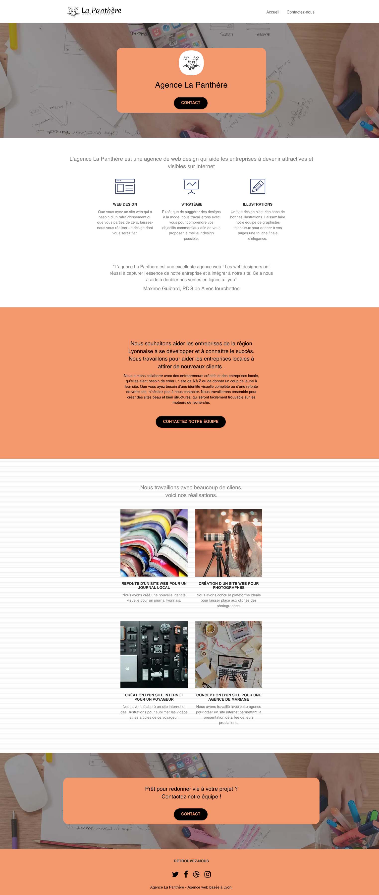

# Agence la Panthère

-   Quatrième projet du parcours "Développeur web" chez OpenClassroom.
-   [Pour visualiser le site optimisé](https://vincetalgorn.github.io/VinceTalgorn_Openclassrooms_Projet_4/).
-   [Pour visualiser le site à optimiser](https://vincetalgorn.github.io/Test_SEO/).
-   L'objectif est d'optimiser un site web existant

## Objectifs

1. Optimiser le référencement d'un site web
2. Écrire un code HTML et CSS maintenable
3. Réaliser une recherche des bonnes pratiques en développement web
4. Optimiser la taille et la vitesse d'un site web
5. Assurer l'accessibilité d'un site web

## Livrables

### Rapport d'analyse

-   Vous trouverez un [rapport d'analyse](./Optimisez_un_site_web_existant_Talgorn_Vincent/Talgorn_Vincent_1_rapport%20analyse_072022.xlsx) sous format Excel. Dans ce document, sont détaillées 10 recommandations afin d'améliorer et de répondre aux objectifs listés au-dessus.

### Rapport d'optimisation

-   Vous trouverez un [rapport d'optimisation](./Optimisez_un_site_web_existant_Talgorn_Vincent/Talgorn_Vincent_3_rapport_optimisation_072022.pdf) sous format PDF. Dans ce document est détaillé sont détaillés, le contexte de la misison, les recommandtations et les tests de performances du site avant/après mise en place de ces 10 recommandations.

## Contact

Vous pouvez me contacter sur le [workplace d'openclassrooms](https://openclassrooms.workplace.com/profile.php?id=100081178936136), sur [twitter](https://twitter.com/TalgornVincent) ou sur mon [adresse mail](mailto:talgorn.v@gmail.com).
